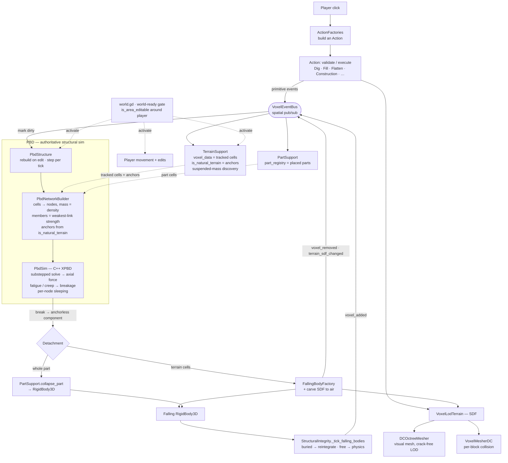

# Diagrams

Visual maps of how the game's systems fit together. Rendered with
[Mermaid](https://mermaid.js.org/) (plain text → renders on GitHub and in most
markdown previewers; in VS Code use a Mermaid preview extension).

Companion to: `CLAUDE.md` (where code lives), `docs/architecture.md` (mechanism
rationale), `docs/roadmap` (version strategy).

---

## System data-flow

The big picture: **how a click becomes physics, and how physics becomes terrain
again.** The shape to notice is the **feedback loop** — edits don't call systems
directly; they emit *events* on a bus. The tracking layer and the PBD simulation
both listen, and when PBD collapses something it emits the *same kind* of edit
events, so a collapse flows back through the bus exactly like a player edit did.

### Walkthrough

1. **Click → Action.** A click asks `ActionFactories` for the right `Action`
   (Dig, Fill, Construction, …); the Action `validate()`s (refuse-don't-deform),
   then `execute()`s, mutating the terrain SDF and **emitting primitive events**
   (`terrain_sdf_changed`, `voxel_added/removed`, `part_added/removed`).
2. **Bus fan-out.** The `VoxelEventBus` dispatches each event to its subscribers
   (spatially, by cell). Nobody is called directly — this is what lets a collapse
   re-enter the same pipeline later.
3. **Tracking spine.** `TerrainSupport` keeps the set of *tracked* cells
   (`voxel_data`), answers "is this natural bedrock?" (`is_natural_terrain` →
   anchors), and discovers suspended mass when you dig under something.
   `PartSupport` keeps the placed-part registry.
4. **PBD builds + solves.** On any edit, `PbdStructure` rebuilds a mass-spring
   network from the tracked cells + parts (`PbdNetworkBuilder`: one node per
   cell, node mass from material *density*, members at the *weakest-link*
   strength of their two cells, cells touching natural terrain pinned as
   *anchors*). Each physics tick `PbdSim` (C++ XPBD) solves it — gravity,
   constraint projection, peak axial force — and an over-limit member accrues
   *fatigue* until it breaks. Settled nodes *sleep* so a quiescent structure
   costs nothing.
5. **Break → detach → collapse.** When a break leaves a component with no path to
   an anchor, it's falling: terrain cells get **carved out of the SDF** and handed
   to `FallingBodyFactory` (a `RigidBody3D`); a part with a detached cell **drops
   whole** via `collapse_part`. The carve emits `voxel_removed` /
   `terrain_sdf_changed` — **back onto the bus** — so the rest of the world
   reacts, and PBD rebuilds without those cells.
6. **Falling bodies re-integrate.** `_tick_falling_bodies` watches each debris
   body: fully buried → dissolve back into the SDF as tracked terrain (emit
   `voxel_added`); free → leave it to physics.
7. **Terrain is rendered twice.** The SDF is meshed by `DCOctreeMesher` for the
   crack-free LOD *visual* and by `VoxelMesherDC` per-block for *collision*.
8. **Nothing runs early.** On startup/reset every gameplay+physics system sits
   inactive until `world.gd` confirms the terrain has streamed in
   (`is_area_editable` around the player) and emits `world_ready` — so the player
   can't fall through ungrown ground and PBD can't anchor against an absent SDF.
